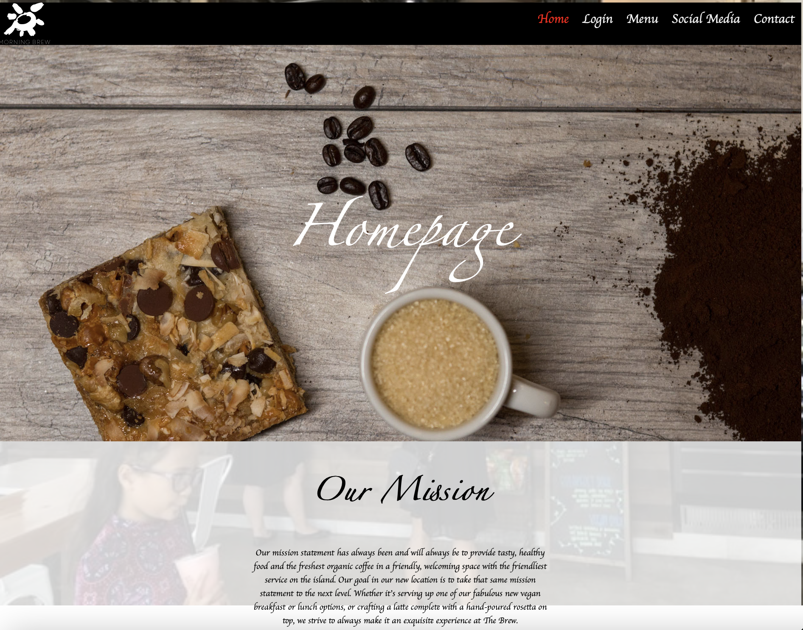
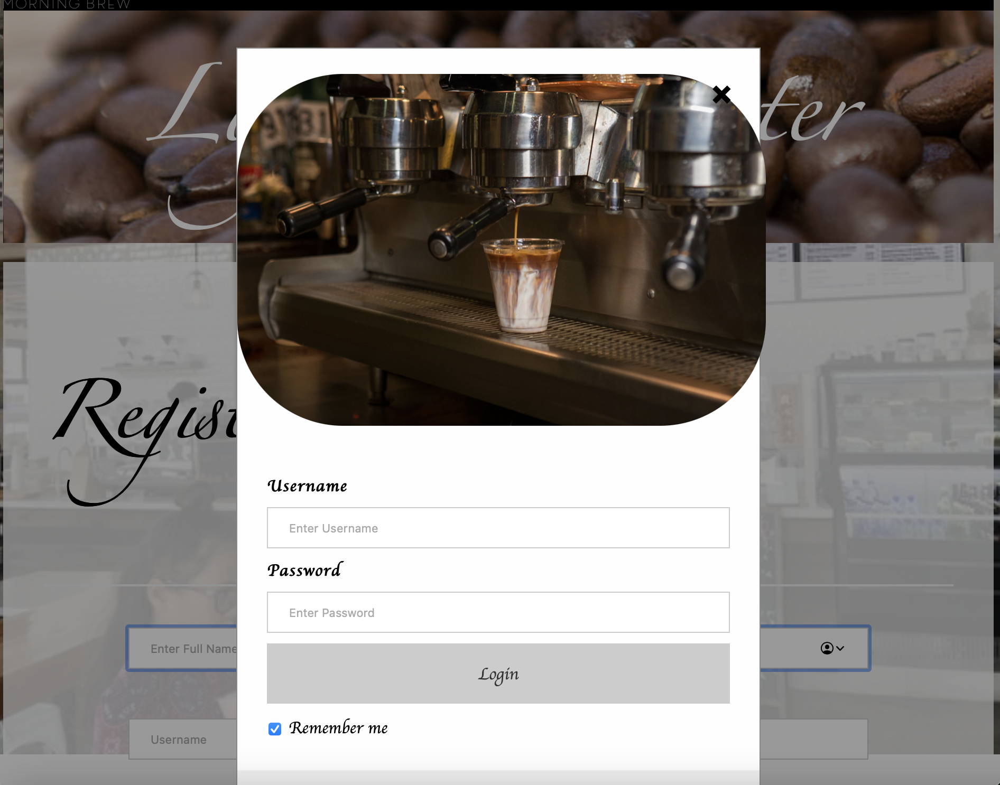

 

Our project was to develop a website for a company in Hawaii called Morning Brew. We needed to make a login page and feature aspects of the restaurant on the website. This code features a login, social media, Contact, Location and Menu pages before you login. 
After the login page you there are the same pages but also it includes a personalize page (not finished) and a stamp card page (incomplete). The stamp card page uses onclick events to add stamps to the card however because it is incomplete it does not save the number of stamps you have for the account. The personalized page was going to feature your name (based on your login information) and information about your favorite items from the menu. 

 
This project uses SQL to store all the login information and JavaScript/HTML/CSS to create the website. 

Code: <a href="https://github.com/nnagatoshi/nnagatoshi.github.io/tree/master/test"><i class="large github icon"></i>GitHub file containing all the code</a>
 
Video: <a href="https://www.youtube.com/watch?v=o7Stf9bsP8g"><i class="large github icon"></i>Virtual Tour</a>

